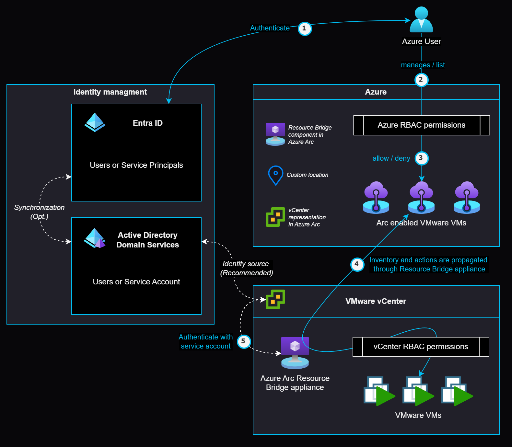
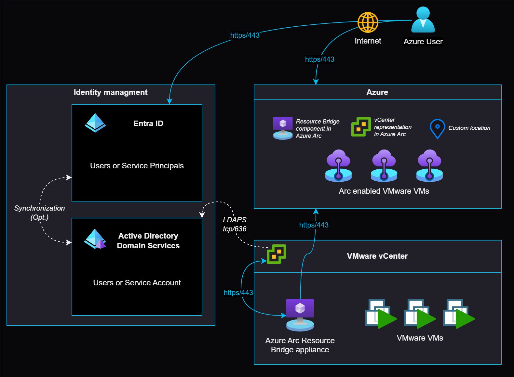
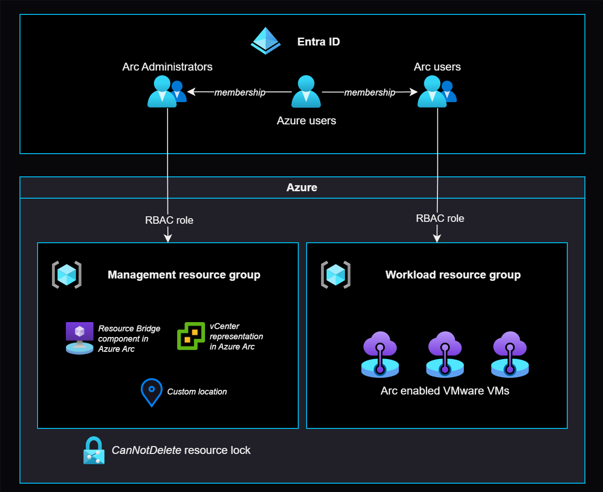

# Identity and access management for Azure Arc-enabled VMware vSphere

Azure Arc-enabled VMware vSphere supports on-premises and other cloud environments that are integrated with different identity and access management systems. In addition to existing VMware vCenter role-based access control (RBAC), Azure Arc-enabled VMware vSphere supports Azure RBAC to unify access management across VMware vCenter and minimize operational overhead.

The combination RBAC models your organization should depend on what usage needs your organization has. Some examples are:

- Onboarding a VMware vCenter to Azure Arc
- Register and manage Virtual Machines of an Arc-enabled VMware vCenter
- Deploy guest management (Arc agent) and extensions (Azure Policy, Azure Monitor, etc.) on Arc-enabled VMware vSphere virtual machines.
- Deploy new VMware virtual machines on an Arc-enabled VMware vCenter
- Using Azure RBAC to access Azure resources

Understanding both your organization's needs and Azure Arc-enabled VMware vSphere's capabilities allows you to choose the best RBAC models for your specific infrastructure, security, and governance requirements as you build an Arc-enabled VMware vCenter.

This article describes Azure Arc-enabled VMware vSphere identity and access management (IAM) architecture, design considerations, recommendations, and role-based access controls for various scenarios.

## Architecture

To design the right architecture for your organization, you need to understand [Azure Arc resource bridge](/azure/azure-arc/resource-bridge/overview) and [Azure Arc Custom Location](/azure/azure-arc/platform/conceptual-custom-locations) which help to extend Azure Arc capabilities over on-premises or third party hosting locations.

### Azure RBAC on Azure Arc-enabled VMware vSphere

The following diagram shows various Azure Arc-enabled VMware vSphere components and how they interact when [Azure RBAC](/azure/role-based-access-control/overview) is used to manage a VMware vCenter.

### Securely access Azure Arc-enabled VMware vSphere resources from anywhere

The following diagram displays [Azure Arc-enabled VMware vSphere access from anywhere](/azure/azure-arc/resource-bridge/overview) and shows how components interact with each other to manage vCenter virtual machine using Azure RBAC.

## Design considerations

Review the [identity and access management design area](../../../ready/landing-zone/design-area/identity-access.md) of Azure landing zones and [identity and access management design area](../../../scenarios/hybrid/arc-enabled-servers
/eslz-identity-and-access-management.md) of Azure Arc-enabled servers to assess the effect of Azure Arc-enabled VMware vSphere on your overall identity and access model.

**For VMware vCenter onboarding:**

<!-- TODO: Check hyperlink when the appropriate documentation is created. -->
- Decide between Microsoft Entra user (for manual onboarding of single vCenter) vs service principal (for scripted and headless onboarding of multiple vCenters) for onboarding VMware vCenters to Azure Arc individually or at scale. For more implementation details, refer to the [Automation disciplines critical design area](./eslz-arc-vmware-automation-disciplines.md).
  - If you chose a service principal, create a service principal and assign the appropriate Azure RBAC role (*Azure Arc VMware Private Clouds Onboarding*) to the service principal. [This should go into recommendations]
- It is recommended to use an external identity source like Microsoft Active Directory Domain Services (AD DS) or LDAPS server to manage identities at vCenter level. [This should go into recommendations, we can discuss if we should have this recommendation or not since its on the VMware level]
- [Microsoft Active Directory Domain Services (AD DS) synchronization with Microsoft Entra ID](/entra/identity/domain-services/synchronization) can help to reduce the bridge between on-premises and Azure identities. [we can discuss if we should have this recommendation or not since its on the VMware level]
- Create a specific vCenter RBAC role with [appropriate permissions](/azure/azure-arc/resource-bridge/troubleshoot-resource-bridge#insufficient-permissions) for Azure Arc-enabled VMware vSphere appliance. [This should be a recommendation]
- Create a dedicated service account and [assign the specific role to the service account](/azure/azure-arc/vmware-vsphere/support-matrix-for-arc-enabled-vmware-vsphere#required-vsphere-account-privileges) at vCenter root level. [This should be a recommendation]

**For VMware vCenter management:**

- As Azure Arc-enabled VMware vSphere brings Microsoft Entra authentication and Azure RBAC to on-premises or other vCenter environments, you must decide between existing vCenter access management and [Azure RBAC](/azure/role-based-access-control/overview), depending on your organization's security and governance requirements.
- Determine if Azure Arc-enabled VMware vSphere gives you the flexibility to [perform administration of VMware vCenter](/azure/azure-arc/vmware-vsphere/administer-arc-vmware) without your inbound firewall ports being open to your on-premises or other cloud networks.
- Determine if Azure RBAC is the right choice when you have many VMware vCenters running in on-premises and other cloud environments and you need to simplify identity administration across all VMware vCenters.

## Design recommendations

**For VMware vCenter onboarding:**

- Use [Microsoft Entra security groups](/entra/fundamentals/how-to-manage-groups) to grant Azure Arc-enabled VMware vSphere RBAC roles for onboarding and managing Azure Arc-enabled VMware vSphere instances.
- In Azure, separate the Azure Arc-enabled VMware vSphere management components (Custom Location, Resource Bridge Appliance, vCenter) and workload items in separate resource groups to simplify access management.
- Use [Azure Resource Locks](/azure/azure-resource-manager/management/lock-resources) to prevent accidental deletion of Azure Arc-enabled VMware vSphere management components.

  
**For VMware vCenter management:**

- If your [on-premises identities are synchronized with Microsoft Entra ID](/entra/identity/domain-services/synchronization), use the same identities when using Azure RBAC for vCenter resources management.
- Simplify your access management by creating [security groups](/entra/fundamentals/how-to-manage-groups) and map them to the Azure RBAC roles supported by Azure Arc-enabled VMware vSphere. Assign permissions to these security groups at the resource group or subscription level depending on your resource organization and governance requirements.
- Avoid direct user assignment to Azure RBAC roles, since it is difficult to govern access management.
- Decentralize and delegate access management responsibility and audit assignments by assigning security group owners.
- Enable periodic [access reviews](/entra/id-governance/privileged-identity-management/pim-create-roles-and-resource-roles-review) in Microsoft Entra ID to remove users that no longer need access to the VMware vCenters.
- Create [conditional access policies](/entra/identity/conditional-access/howto-conditional-access-policy-azure-management) when using Azure RBAC for vCenter resources management to enforce various conditions to meet security and governance policies.
  
## Role based access controls

Azure Arc-enabled VMware vSphere manages VMware vCenters using Azure RBAC and supports the following Roles for onboarding VMware vCenters to Azure Arc.

| Role                                       | Description |
|--------------------------------------------|-------------|
| Azure Arc VMware Administrator role        | Arc VMware VM Contributor has permissions to perform all connected VMwarevSphere actions. |
| Azure Arc VMware Private Cloud User        | Azure Arc VMware Private Cloud User has permissions to use the VMware cloud resources to deploy VMs. |
| Azure Arc VMware Private Clouds Onboarding | Azure Arc VMware Private Clouds Onboarding role has permissions to provision all the required resources for onboard and deboard vCenter instances to Azure. |
| Azure Arc VMware VM Contributor            | Arc VMware VM Contributor has permissions to perform all VM actions. |

## Next steps

For more information on your hybrid and multicloud cloud journey, see the following articles:

- Review the [prerequisites and support requirements](/azure/azure-arc/vmware-vsphere/support-matrix-for-arc-enabled-vmware-vsphere) for using Azure Arc-enabled VMware vSphere.
- Review [Manage hybrid and multicloud environments](../manage.md).
- Review [common conditional access policies](/azure/active-directory/conditional-access/plan-conditional-access) to apply when using Azure RBAC for Azure Arc-enabled VMware vSphere environment.
- Learn how to [update vSphere account credentials used in resource bridge appliance](/azure/azure-arc/vmware-vsphere/administer-arc-vmware#updating-the-vsphere-account-credentials-using-a-new-password-or-a-new-vsphere-account-after-onboarding).
- Review [Azure Landing Zones - Azure identity and access management design area](../../../ready/landing-zone/design-area/identity-access.md).
- Review the [Cloud Adoption Framework - Access Control](../../../secure/access-control.md) methodology.
- Experience Azure Arc-enabled VMware vSphere automated scenarios with [Azure Arc Jumpstart](https://azurearcjumpstart.io/azure_arc_jumpstart/azure_arc_vsphere).
- Learn more about Azure Arc via the [Azure Arc learning path](/training/paths/manage-hybrid-infrastructure-with-azure-arc/).
